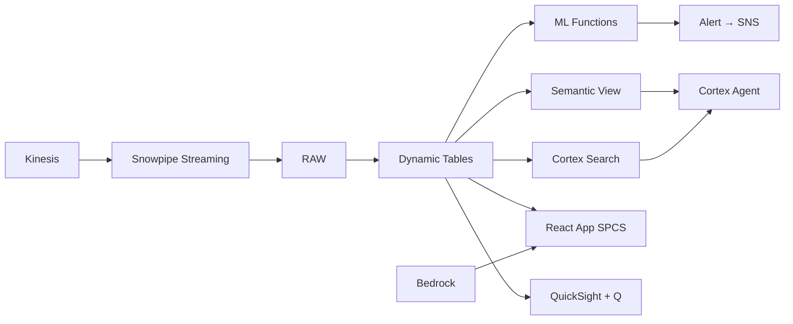

# Destination Marketing Intelligence

Marketing intelligence for Thailand's destination campaigns — Comprehend analyzes sentiment on social content, AI_EXTRACT identifies trending topics, and Cortex Search enables instant content discovery for marketing teams.

## Architecture

Thailand's tourism marketing team manages ฿2.4B across 350 campaigns but can't see which content resonates in which market. Social listening across 6 languages reveals trending topics and sentiment shifts — but fragmented tools mean the insights arrive too late to act on. Unified AI-native analytics closes the gap.



## Snowflake Capabilities

| Capability | Implementation |
|-----------|---------------|
| Dynamic Tables | CAMPAIGN_ROI / SOCIAL_SENTIMENT_TRENDS / TRENDING_TOPICS / COMPETITIVE_POSITIONING |
| ML Functions | ML.FORECAST + ML.ANOMALY_DETECTION |
| Cortex AI | AI_SENTIMENT, AI_EXTRACT, AI_CLASSIFY |
| Cortex Search | 5000 documents indexed |
| Cortex Agent | MARKETING_INTEL_AGENT |
| Semantic View | MARKETING_ANALYTICS |
| React App (SPCS) | 5 tabs + DemoGuide |


## AWS Services

| Service | Role in Demo |
|---------|-------------|
| Amazon Comprehend | Sentiment analysis and entity extraction from 500K social posts |
| Amazon Kinesis | Stream real-time social media feeds |
| Amazon Bedrock (Claude) | Generate marketing intelligence briefs and content recommendations |
| Amazon Personalize | Content recommendation engine for marketing teams |
| Amazon SNS | Alert marketing team on sentiment crises and viral opportunities |
| Amazon QuickSight + Q | Marketing performance dashboard with NL queries |


## Personas

| Persona | Role | Key Questions |
|---------|------|---------------|
| **Varinda Kanchanawat** | CMO (Tourism Group) | "What's our campaign ROI by channel and market?" "How is Thailand perceived vs competitors (Bali, Vietnam)?" |
| **Tanawat Ruangkanchanasetr** | Digital Marketing Manager | "What content is trending in the Korean market?" "Which influencer partnerships drove the most bookings?" |


## Data

| Table | Rows | Description |
|-------|------|-------------|
| CAMPAIGNS | 350 | Marketing campaigns with budget, channel, and target market |
| SOCIAL_CONTENT | 500,000 | Social media posts mentioning Thailand tourism (Instagram, TikTok, X, Xiaohongshu) |
| CAMPAIGN_PERFORMANCE | 12,000 | Daily campaign metrics (impressions, clicks, conversions, cost) |
| INFLUENCER_PARTNERSHIPS | 200 | Influencer collaborations with performance data |
| CONTENT_LIBRARY | 5,000 | Marketing content assets (videos, images, articles) with metadata |
| COMPETITOR_ANALYSIS | 100,000 | Competitor destination marketing data (Bali, Vietnam, Philippines) |
| BOOKING_ATTRIBUTION | 75,000 | Marketing-attributed bookings with multi-touch paths |
| THAI_DESTINATION_DATA | 50 | Destination-level visitor data and positioning |


## Build Instructions

### Prerequisites
- Snowflake account with ACCOUNTADMIN access
- Cortex AI enabled (ML Functions, Search, Agent)
- Warehouse: MARKETING_WH (Medium)
- AWS CLI with access (us-west-2)

### Deployment

```bash
snowsql -f snowflake/00_setup.sql
snowsql -f snowflake/01_marketplace_install.sql
snowsql -f snowflake/02_raw_tables.sql
snowsql -f snowflake/03_staging.sql
snowsql -f snowflake/04_dynamic_tables.sql
snowsql -f snowflake/05_search.sql
snowsql -f snowflake/06_ml_models.sql
snowsql -f snowflake/07_semantic_view.sql
snowsql -f snowflake/08_agent.sql
```

### React App (SPCS)
```bash
cd app && npm ci && npm run build
docker build -t aws-thailand-tourism-marketing-app .
docker push bdiqc8sm-default.registry.snowflakecomputing.com/marketing_intel/app/aws_thailand_tourism_marketing/app:latest
```

### Demo Mode
Open the app URL with `?demo=true` for presenter view.

## Build Modes

### Snowflake Only
Run scripts 00-08 (skip AWS-specific integration). Uses:
- **AI_SENTIMENT + AI_EXTRACT (native)** instead of Amazon Comprehend
- **Snowpipe Streaming SDK** instead of Amazon Kinesis
- **Cortex Complete** instead of Amazon Bedrock (Claude)
- **Cortex Search + Cortex Complete** instead of Amazon Personalize
- **Alerts + Notification Integration** instead of Amazon SNS
- **Snowflake Intelligence (Cortex Analyst)** instead of Amazon QuickSight + Q

### Full AWS + Snowflake
Run all scripts including AWS integration. Deploy QuickSight dashboard from `quicksight/`.

## Business Impact

Industry research and Snowflake customer outcomes:
- **Thailand allocated ฿8B for international tourism marketing in 2024 across 20+ markets** — [TAT Thailand](https://www.tat.or.th/en)
- **AI-powered marketing analytics improves campaign ROI by 20-40% through better targeting** — [McKinsey Marketing](https://www.mckinsey.com/capabilities/growth-marketing-and-sales/our-insights)
- **Social listening enables 3x faster response to brand crises vs traditional monitoring** — [Gartner Marketing](https://www.gartner.com/en/marketing)
- **TikTok influencer marketing generates 5-10x higher engagement than traditional ads for tourism** — [Phocuswright](https://www.phocuswright.com/Travel-Research)
- **Wyndham Hotels** (Snowflake customer): unified 30+ brands on a single data platform, enabling real-time revenue optimization across 9,000+ properties -- [snowflake.com/customers/accor](https://www.snowflake.com/en/customers/all-customers/case-study/accor/)

## Key Demo Numbers

- **4.2x ROI** portfolio average across 350 campaigns (target: 5x)
- **500K posts** social content analyzed in 6 languages
- **8.3x ROI** TikTok influencer partnerships (top channel)
- **5,000 assets** in content library indexed by Cortex Search
- **0.74 sentiment** Thailand tourism (ahead of Bali, behind Japan)
- **฿2.4B** marketing budget optimized across channels and markets


## License

Apache 2.0 — See [LICENSE](LICENSE) for details.

This is a personal demo project and is not an official Snowflake offering. It comes with no support or warranty.